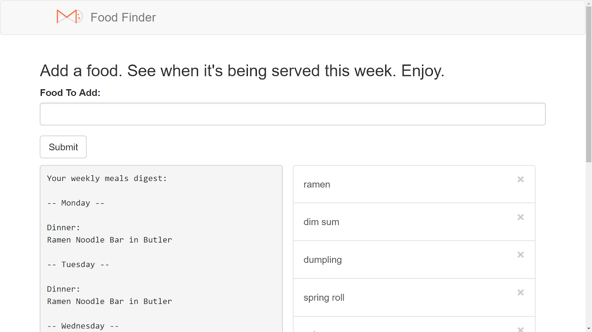

# Food Finder

A simple app that tells you when your favorite foods are being served in the dining halls.

Also a simple example of using flask-cas (which has a Princeton specific bug).

The Princeton CAS issue is documented here:
https://github.com/cameronbwhite/Flask-CAS/issues/38

The workaround is in the requirements.txt file
